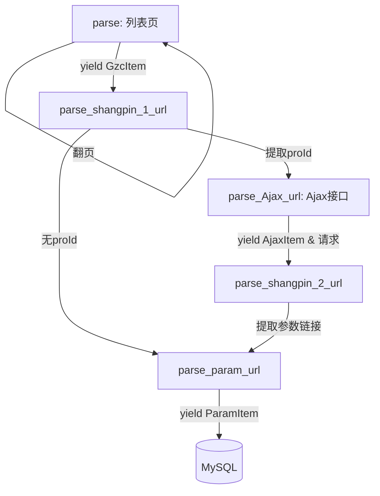

```markdown
项目名称：中关村在线笔记本参数爬虫

一句话介绍：异步爬取中关村在线笔记本详细参数（含 SKU 价格、规格），并存储到 MySQL，支持断点续爬。

---

## 📌 项目简介

- **目标网站**：中关村在线笔记本列表页  
  `https://detail.zol.com.cn/notebook_index/subcate16_0_list_1_0_99_1_0_1.html`
- **爬取内容**：  
  - 列表页商品（名称、链接）  
  - 每个商品的所有 SKU 信息（SKU ID、价格、颜色、版本）  
  - 每个商品的完整规格参数（CPU、内存、屏幕、显卡等 40+ 字段）及电商报价
- **数据量级**：链接的所有分页
- **技术特色**：
  - 自动提取页面 JavaScript 变量构造 Ajax 接口 URL，直接抓取 SKU 价格
  - 智能绕过反爬验证页面，配合随机 User‑Agent、自动限速、下载延迟
  - 支持 MySQL 入库，自动建表，冲突更新
  - 保留 Scrapy 原生断点续爬能力（通过 `JOBDIR`）

---

## 🛠️ 技术栈

|  类别  |        工具/库         |
|:----:|:-------------------:|
|  框架  |       Scrapy        |
| 请求伪装 |   fake_useragent    |
|  储存  |       pymysql        |
| 数据解析 |     lxml / css       |
| 其他依赖 |      json, re        |

---

## 🔄 核心爬取流程

该项目采用多条解析链并行工作，流程图如下（文字描述）：

1. **列表页**  
   `parse` → 解析商品列表，生成 `GzcItem`（名称、链接）并自动翻页。

2. **商品详情页（第一步）**  
   `parse_shangpin_1_url` → 从 `<script>` 中提取 `proId`、`mainId` 等关键 ID。  
   - 若成功获取 `proId` → 构造 Ajax 地址：  
     `https://detail.zol.com.cn/xhr5_Product_GetProSkuInfo_proId={proId}.html`  
     交由 `parse_Ajax_url` 处理。  
   - 若缺失 ID → 直接在页面中寻找“参数”链接，跳转至参数页。

3. **Ajax 接口（SKU 信息）**  
   `parse_Ajax_url` → 解析 JSON，遍历所有 SKU，生成 `AjaxItem`（skuId, price, proUrl, 颜色, 版本）。  
   对每个 SKU 拼接完整 URL（带 `?skuId=` 参数），请求商品详情页（`parse_shangpin_2_url`），同时将价格信息通过 `cb_kwargs` 传递。

4. **商品详情页（第二步）**  
   `parse_shangpin_2_url` → 提取“查看完整参数”链接，跳转到参数页 `parse_param_url`，并继续传递 `priceitem`。

5. **参数页**  
   `parse_param_url` → 解析产品型号、CPU、内存、屏幕等 40+ 项参数，生成 `ParamItem`。  
   优先从页面“电商报价”行提取京东价格，若不存在则回退为 `priceitem` 中的价格。

所有 Item 经 Pipeline 写入 MySQL。



---

## 🗄️ 数据库设计

Pipeline 自动创建三张表（`utf8mb4` 编码）：

### `gzc_items` – 列表页商品
| 字段 | 类型 | 说明 |
|------|------|------|
| id | INT AUTO_INCREMENT PRIMARY KEY | 自增主键 |
| name | VARCHAR(255) | 商品名称 |
| link | VARCHAR(500) | 商品详情页链接 |
| created_at | TIMESTAMP | 记录创建时间 |

### `ajax_items` – SKU 信息（唯一索引：`skuId`）
| 字段 | 类型 | 说明 |
|------|------|------|
| id | INT AUTO_INCREMENT PRIMARY KEY | 自增主键 |
| skuId | VARCHAR(50) UNIQUE | 商品 SKU ID |
| price | VARCHAR(50) | 价格 |
| proUrl | VARCHAR(500) | SKU 对应的商品路径 |
| yanse | VARCHAR(100) | 颜色 |
| banben | VARCHAR(255) | 版本 |
| created_at | TIMESTAMP | 记录创建时间 |

### `param_items` – 详细参数（唯一索引：`product_model`）
| 类别 | 字段（部分） |
|------|-------------|
| 基础 | product_name, product_model, ecommerce_price, jd_price, launch_date... |
| 处理器 | cpu_series, cpu_model, max_frequency, cores_threads... |
| 存储 | ram_capacity, ram_type, hdd_capacity, hdd_description |
| 屏幕 | touch_screen, screen_type, screen_size, screen_resolution, refresh_rate, srgb_gamut... |
| 显卡 | gpu_type, gpu_chip, video_memory, memory_type, direct_gpu_connection |
| 多媒体 | camera, audio_system, speaker, microphone |
| 网络 | wlan, ethernet, bluetooth |
| 输入 | pointing_device, keyboard_desc, fingerprint_scanner, face_recognition |
| 电源 | battery_type, battery_life, power_adapter |
| 外观 | chassis_material, chassis_color |
| 保修 | warranty_policy, warranty_period |

> 完整字段请查看 `items.py` 中的 `ParamItem` 定义。

---

## ⚙️ 配置说明 (`settings.py`)

```python
# 下载延迟与并发
DOWNLOAD_DELAY = 2
CONCURRENT_REQUESTS_PER_DOMAIN = 1

# 自动限速（防封）
AUTOTHROTTLE_ENABLED = True
AUTOTHROTTLE_START_DELAY = 5
AUTOTHROTTLE_MAX_DELAY = 60
AUTOTHROTTLE_TARGET_CONCURRENCY = 1.0

# 重试次数
RETRY_TIMES = 3

# 中间件：随机 User-Agent
DOWNLOADER_MIDDLEWARES = {
    'gzc.middlewares.RandomUserAgentMiddleware': 400,
    'scrapy.downloadermiddlewares.useragent.UserAgentMiddleware': None,
}

# Pipeline
ITEM_PIPELINES = {
    'gzc.pipelines.GzcPipeline': 300,
}
```

数据库连接默认读取 `settings.py` 中的 `DB_CONFIG`，如未显式定义则使用硬编码默认值（请按需修改）：
```python
DB_CONFIG = {
    'host': 'localhost',
    'user': 'root',
    'password': 'your_password',
    'db': 'data',
    'charset': 'utf8mb4',
}
```

---

## 🚀 快速开始

### 环境要求
- Python 3.7+
- MySQL 5.7+
- 安装依赖：
```bash
pip install scrapy pymysql fake-useragent
```

### 启动爬虫
```bash
# 普通运行
scrapy crawl bjb_price

# 断点续爬（创建或指定 JOBDIR 目录）
scrapy crawl bjb_price -s JOBDIR=jobdir1
```

### 运行结果
- 控制台会输出日志级别 `INFO` 的进度信息（可在 `bjb_price.py` 顶部修改 `logging.basicConfig(level=...)`）。
- 抓取的数据实时写入 MySQL 的 `gzc_items`、`ajax_items`、`param_items` 三张表。

---

## 📝 注意事项
1. **反爬策略**：网站可能存在防刷验证页面，代码已做检测并记录日志，必要时可增加代理或进一步降低速度。
2. **数据完整性**：部分参数（如电商报价）可能缺失，程序会尝试从 Ajax 返回的价格回填。
3. **表结构**：每次启动 Pipeline 会自动执行 `CREATE TABLE IF NOT EXISTS`，不会覆盖已有数据；`param_items` 以 `product_model` 为唯一索引，重复插入会触发更新。
4. **自定义**：可在 `pipelines.py` 中修改数据库配置，或在 `settings.py` 中添加 `DB_CONFIG` 字典覆盖默认值。

---

## 📦 项目结构
```
gzc/
├── spiders/
│   └── bjb_price.py          # 爬虫主逻辑
├── items.py                  # 数据项定义
├── middlewares.py            # 中间件（随机UA）
├── pipelines.py              # 数据存储管道
├── settings.py               # 项目配置
├── 关中村笔记本数据爬虫分析SOP.md # 抓包分析
├── 关中村笔记本数据爬虫分析SOP.km # 抓包分析
└── README.md

```